> 一些小的tips：

运行游戏不重新编译

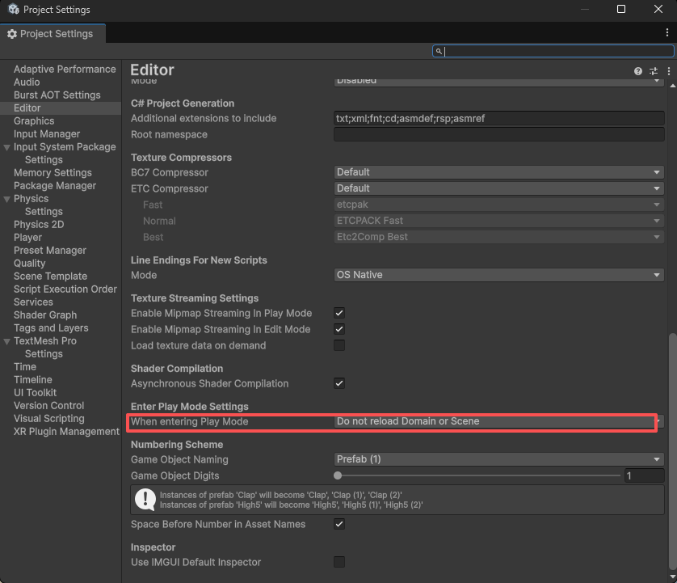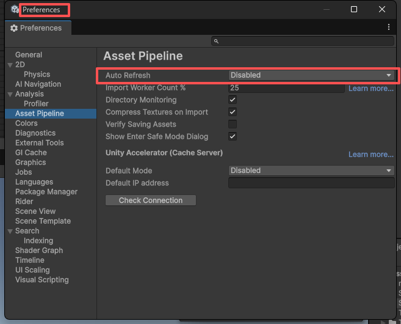

## Day01 Input

### 导入资产


给赛道加上collider

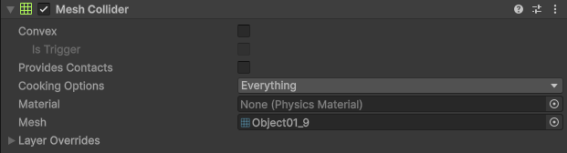

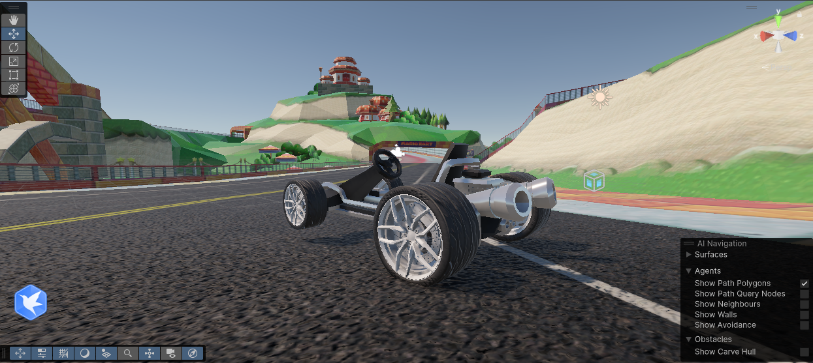

### 车子的控制器脚本

|      | 键盘         | 手柄                                 |
| ---- | ------------ | ------------------------------------ |
| 移动 | Move（W/S）  | LeftTrigger/RightTrigger（左右扳机） |
| 转向 | Steer（A/D） | Steer（左摇杆）                      |

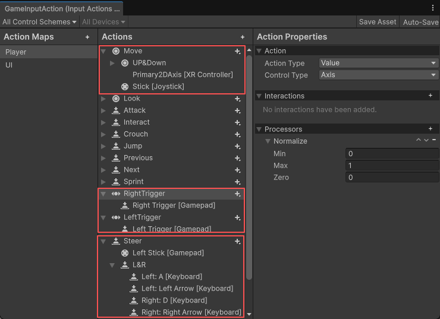

#### 整体位置朝向更新

```csharp
using UnityEngine;

namespace RacingGame.Car
{
    public class CarController : MonoBehaviour
    {
        public WheelCollider[] wheelsColliders = new WheelCollider[4];   //轮子collider
        public float motorTorque = 200;                         //转矩
        public float steeringMax = 30;                          //最大转向角

        private void FixedUpdate()
        {
            InputControl();
        }

        private void InputControl()
        {
            //如果手柄有输入就优先传入手柄值
            //  手柄、键盘的前进后退
            var accelerator = (Mathf.Abs(GameInputManager.Instance.RightTrigger) > 0.01f || Mathf.Abs(GameInputManager.Instance.LeftTrigger) > 0.01f)
                ? ((GameInputManager.Instance.RightTrigger) - (GameInputManager.Instance.LeftTrigger))
                : GameInputManager.Instance.Move.y;

            var steerInput = GameInputManager.Instance.Steer.x;
            var handBrake =  GameInputManager.Instance.HandBrake;      //手刹
  
            var targetMotorTorque = (accelerator != 0) ? motorTorque : 0;
            var targetSteeringMax = (steerInput != 0) ? steeringMax : 0;
  
            //更新每个轮子的转矩
            foreach (var wheelCollider in wheelsColliders)
            {
                wheelCollider.motorTorque = accelerator * targetMotorTorque;
            }
  
            //只更新前轮的转向角度
            for (int i = 0; i < wheelMeshes.Length - 2; i++)
            {
                wheelsColliders[i].steerAngle = steerInput * targetSteeringMax;
            }
  
        }
    }
}

```

#### 车轮模型Mesh的位置朝向更新

```csharp
        private void FixedUpdate()
        {
            AnimateWheels();

            InputControl();
        }
```

```csharp
        /// <summary>
        /// 轮子转动动画——改变Mesh的属性
        /// </summary>
        private void AnimateWheels()
        {
            var wheelPosition = Vector3.zero;           //位置
            var wheelRotation = Quaternion.identity; //朝向
  
            for (int i = 0; i < wheelsColliders.Length; i++)
            {
                //获取wheelCollider的位置朝向
                wheelsColliders[i].GetWorldPose(out wheelPosition, out wheelRotation);
                //改变wheelmesh的位置朝向
                wheelMeshes[i].transform.position = wheelPosition;
                wheelMeshes[i].transform.rotation = wheelRotation;
            }
        }
```

### 相机平滑跟随

```csharp
using UnityEngine;

namespace RacingGame.Camera
{
    public class CameraController : MonoBehaviour
    {
        [Header("玩家"), SerializeField]
        private GameObject player;
        [Header("相机目标位置"),SerializeField]
        private GameObject target;
  
        [Header("相机跟随速度"),SerializeField]
        private float followSpeed;

        private void FixedUpdate()
        {
            FollowTarget();
        }
        /// <summary>
        /// 跟随目标
        /// </summary>
        private void FollowTarget()
        {
            //位置更新：当前位置 -- Lerp --> 目标位置
            gameObject.transform.position = Vector3.Lerp(
                transform.position,
                target.transform.position,
                Time.deltaTime * followSpeed
                );
            //朝向玩家
            gameObject.transform.LookAt(player.transform);
  
        }
    }
}
```

演示：


### 代码整理：

CarController

```csharp
using UnityEngine;

namespace RacingGame.Car
{
    public class CarController : MonoBehaviour
    {
        public WheelCollider[] wheelsColliders = new WheelCollider[4];   //轮子collider
        public GameObject[] wheelMeshes = new GameObject[4];    //轮子Mesh
        public float motorTorque = 200;                         //转矩
        public float steeringMax = 30;                          //最大转向角

        private void FixedUpdate()
        {
            AnimateWheels();

            InputControl();
        }

        private void InputControl()
        {
            //如果手柄有输入就优先传入手柄值
            //  手柄、键盘的前进后退
            var accelerator = (Mathf.Abs(GameInputManager.Instance.RightTrigger) > 0.01f || Mathf.Abs(GameInputManager.Instance.LeftTrigger) > 0.01f)
                ? ((GameInputManager.Instance.RightTrigger) - (GameInputManager.Instance.LeftTrigger))
                : GameInputManager.Instance.Move.y;

            var steerInput = GameInputManager.Instance.Steer.x;
            var handBrake =  GameInputManager.Instance.HandBrake;      //手刹
  
            var targetMotorTorque = (accelerator != 0) ? motorTorque : 0;
            var targetSteeringMax = (steerInput != 0) ? steeringMax : 0;
  
            //更新每个轮子的转矩
            foreach (var wheelCollider in wheelsColliders)
            {
                wheelCollider.motorTorque = accelerator * targetMotorTorque;
            }
  
            //只更新前轮的转向角度
            for (int i = 0; i < wheelMeshes.Length - 2; i++)
            {
                wheelsColliders[i].steerAngle = steerInput * targetSteeringMax;
            }
  
        }

        /// <summary>
        /// 轮子转动动画——改变Mesh的属性
        /// </summary>
        private void AnimateWheels()
        {
            var wheelPosition = Vector3.zero;           //位置
            var wheelRotation = Quaternion.identity; //朝向
  
            for (int i = 0; i < wheelsColliders.Length; i++)
            {
                //获取wheelCollider的位置朝向
                wheelsColliders[i].GetWorldPose(out wheelPosition, out wheelRotation);
                //改变wheelmesh的位置朝向
                wheelMeshes[i].transform.position = wheelPosition;
                wheelMeshes[i].transform.rotation = wheelRotation;
            }
        }
    }
}

```

CameraController

```csharp
using UnityEngine;

namespace RacingGame.Camera
{
    public class CameraController : MonoBehaviour
    {
        [Header("玩家"), SerializeField]
        private GameObject player;
        [Header("相机目标位置"),SerializeField]
        private GameObject target;
  
        [Header("相机跟随速度"),SerializeField]
        private float followSpeed;

        private void FixedUpdate()
        {
            FollowTarget();
        }
        /// <summary>
        /// 跟随目标
        /// </summary>
        private void FollowTarget()
        {
            //位置更新：当前位置 -- Lerp --> 目标位置
            gameObject.transform.position = Vector3.Lerp(
                transform.position,
                target.transform.position,
                Time.deltaTime * followSpeed
                );
            //朝向玩家
            gameObject.transform.LookAt(player.transform);
  
        }
    }
}
```

## Day02 分区变速和手刹

### 枚举驱动类型

CarController

```csharp
        /// <summary>
        /// 驱动类型
        /// </summary>
        internal enum DriveType
        {
            FrontWheelDrive,
            RearWheelDrive,
            AllWheelDrive
        }

        [Header("驱动类型"), SerializeField] private DriveType _driveType;
```

```csharp
        private void FixedUpdate()
        {
            AnimateWheels();

            MoveVehicle();
            SteerVehicle();
        }
```

### 车子移动和转向解耦

#### 车子移动：每个驱动类型分别更新转矩

```csharp
        /// <summary>
        /// 车子移动
        /// </summary>
        private void MoveVehicle()
        {
            //如果手柄有输入就优先传入手柄值
            //  手柄、键盘的前进后退
            var accelerateInput = (Mathf.Abs(GameInputManager.Instance.RightTrigger) > 0.01f || Mathf.Abs(GameInputManager.Instance.LeftTrigger) > 0.01f)
                ? ((GameInputManager.Instance.RightTrigger) - (GameInputManager.Instance.LeftTrigger))
                : GameInputManager.Instance.Move.y;
            //  手刹
            var handBrake =  GameInputManager.Instance.HandBrake;
            //  目标转矩
            var targetMotorTorque = (accelerateInput != 0) ? motorTorque : 0;

            switch (_driveType)
            {
                case DriveType.AllWheelDrive:
                    //更新每个轮子的转矩
                    foreach (var wheelCollider in wheelColliders)
                    {
                        wheelCollider.motorTorque = accelerateInput * targetMotorTorque / 4;
                    }
                    break;
                case DriveType.FrontWheelDrive:
                    //更新前轮的转矩
                    for(int i = 0; i < wheelColliders.Length - 2; i++)
                    {
                        wheelColliders[i].motorTorque = accelerateInput * targetMotorTorque / 2;
                    }
                    break;
                case DriveType.RearWheelDrive:
                    //更新后轮的转矩
                    for(int i = 2; i < wheelColliders.Length; i++)
                    {
                        wheelColliders[i].motorTorque = accelerateInput * targetMotorTorque / 2;
                    }
                    break;
            }
        }
```

#### 车子转向：保持不变

```csharp
        /// <summary>
        /// 车子转向
        /// </summary>
        private void SteerVehicle()
        {
            var steerInput = GameInputManager.Instance.Steer.x;        //转向输入
            var handBrake =  GameInputManager.Instance.HandBrake;      //手刹
  
            var targetSteeringMax = (steerInput != 0) ? steeringMax : 0;    //目标最大转向角
            //只更新前轮的转向角度
            for (int i = 0; i < wheelMeshes.Length - 2; i++)
            {
                wheelColliders[i].steerAngle = steerInput * targetSteeringMax;
            }
        }
```

### 手刹

```csharp
        private void MoveVehicle()
        {
            //原先代码
    
            //手刹 - 只对后轮施加制动力
            var handBrakeTorque = handBrake ? brakePower : 0f;
            wheelColliders[2].brakeTorque = wheelColliders[3].brakeTorque = handBrakeTorque;

        }
```

注意InputManager里手刹的按键获取的是IsPressed，也就是按下期间

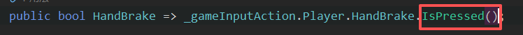

演示效果：


## Day03 修复转向惯性导致的转弯时侧向滑移 —— Ackermann 转向几何

### 引入阿克曼转向几何

> 前面实现的转向是古早的马车行驶模式：使用单铰链转向技术，转弯时内外轮无法指向同一圆心，两个前轮是平行的，转弯过度容易卡住不动，无法顺滑转弯。
>
> 因此，引入阿克曼转向几何（Ackermann steering geometry）：实现转弯时，内外转向轮指向同一个圆心。

#### 设计原理：


#### 计算公式：

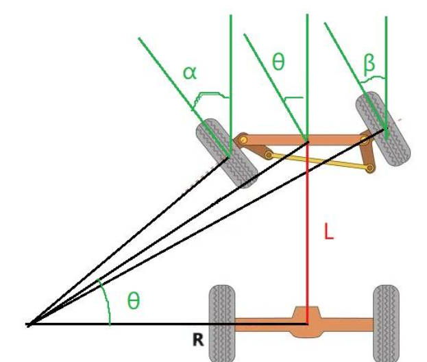

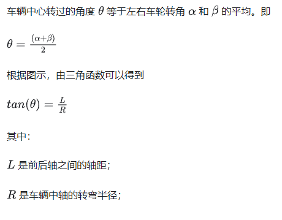

"这里的 ` θ=(α＋β)/2` 做了近似处理"

因此，

左轮转向角增量 = actan( 前后轴距 / 左轮的转弯半径 ) * 转向输入

右轮转向角增量 = actan( 前后轴距 / 右轮的转弯半径 ) * 转向输入

左转时，

左轮的转弯半径 = 中轴转弯半径 - 左右轴距 / 2

右轮的转弯半径 = 中轴转弯半径 + 左右轴距 / 2

右转时，

左轮的转弯半径 = 中轴转弯半径 + 左右轴距 / 2

右轮的转弯半径 = 中轴转弯半径 - 左右轴距 / 2

### 更新转向函数

CarController.cs

```csharp
        public float turnRadius = 6f;           //轮子半径
        public float wheelBase = 2.55f;         //前后轴距
        public float wheelTrack = 1.5f;         //左右轮距
  
        public float motorTorque = 200;                                 //扭矩(车轮转动力)
        // public float steeringMax = 30;   //最大转向角
```

```csharp
        /// <summary>
        /// 车子转向
        /// </summary>
        private void SteerVehicle()
        {
            // var targetSteeringMax = (steerInput != 0) ? steeringMax : 0;    //目标最大转向角
            // //只更新前轮的转向角度
            // for (int i = 0; i < wheelMeshes.Length - 2; i++)
            // {
            //     wheelColliders[i].steerAngle = steerInput * targetSteeringMax;
            // }
            var steerInput = GameInputManager.Instance.Steer.x;        //转向输入

            if (steerInput < 0)
            {   //左转
                wheelColliders[0].steerAngle = Mathf.Rad2Deg * Mathf.Atan(wheelBase / (turnRadius - (wheelTrack / 2))) * steerInput;    //左轮转向角
                wheelColliders[1].steerAngle = Mathf.Rad2Deg * Mathf.Atan(wheelBase / (turnRadius + (wheelTrack / 2))) * steerInput;    //右轮转向角
            }
            else if (steerInput > 0)
            {   //右转
                wheelColliders[0].steerAngle = Mathf.Rad2Deg * Mathf.Atan(wheelBase / (turnRadius + (wheelTrack / 2))) * steerInput;    //左轮转向角
                wheelColliders[1].steerAngle = Mathf.Rad2Deg * Mathf.Atan(wheelBase / (turnRadius - (wheelTrack / 2))) * steerInput;    //右轮转向角
            }
            else
            {   //无转向
                wheelColliders[0].steerAngle = 0;   //左轮转向角
                wheelColliders[1].steerAngle = 0;   //右轮转向角
            }
        }
```

演示：


## 更好的速度感——车辆加速后的镜头滞后感

CarController.cs

```csharp
private Rigidbody _rigidbody;

public float kph;   //  速度 km/h
```

```csharp
private void Start()
{
_rigidbody = GetComponent<Rigidbody>();
}
```

```csharp
        private void MoveVehicle()
        {
	    // 原有代码

            //  km/h = m/s * 3.6
            kph = _rigidbody.linearVelocity.magnitude * 3.6f;
        }
```

> magnitude是获取该变量的绝对值

CameraController.cs

```csharp
        private CarController _controller;
```

```csharp
        private void Awake()
        {
            player = GameObject.FindGameObjectWithTag("Player");
            _controller = player.GetComponent<CarController>();
        }
```

```csharp
        private void FollowTarget()
        {
            // 计算目标跟随速度
            float targetFollowSpeed = (_controller.kph > 50) ? 10 : _controller.kph / 2;
  
            // 平滑更新跟随速度
            followSpeed = Mathf.Lerp(followSpeed, targetFollowSpeed, Time.deltaTime);
  
            //原有代码
        }
```

平滑更新：速度超过50km/h就限制镜头跟随速度为10，低速就车速/2


## Day04 给车子在质心处施加下压力

> 没有下压力，在一定速度后车辆将失去牵引力

CarController.cs

```csharp
        private GameObject _centerOfMass;   //车子的质心
```

```csharp
        private void Start()
        {
            //原先代码

            _rigidbody.centerOfMass = _centerOfMass.transform.localPosition;     //把自定义的质心设置为rigidbody的质心
        }
```

```csharp
        private void FixedUpdate()
        {
            AddDownForce();
  
            //原先代码
        }
```

```csharp
        /// <summary>
        /// 给车子施加下压力
        /// </summary>
        private void AddDownForce()
        {
            var currentSpeed = _rigidbody.linearVelocity.magnitude;
            _rigidbody.AddForce(Vector3.down * (downForceValue * currentSpeed));
        }
```

## Day05 获取摩擦力

CarController.cs

```csharp
        public float[] slips = new float[4];    //Debug: 滑动
```

```csharp
        /// <summary>
        /// 获取摩擦力
        /// </summary>
        /// 读取每个车轮与地面的接触信息，提取车轮的纵向打滑量 forwardSlip
        /// forwardSlip : 反映车轮转速与地面线速度的偏差（纵向打滑比）。数值越大，越打滑.
        private void GetFriction()
        {
            for(int i = 0; i < wheelColliders.Length; i++)
            {
                wheelColliders[i].GetGroundHit(out var hit);
                slips[i] = hit.forwardSlip;
            }
        }
```

```csharp
        private void FixedUpdate()
        {
            //原先代码

            GetFriction();
        }
```

## Day06 代码自动获取objects以适配不同车型

```csharp
using System;
using UnityEngine;

namespace RacingGame.Car
{
    public class CarController : MonoBehaviour
    {
        /// <summary>
        /// 驱动类型
        /// </summary>
        internal enum DriveType
        {
            FrontWheelDrive,
            RearWheelDrive,
            AllWheelDrive
        }

        [Header("驱动类型"), SerializeField] private DriveType _driveType;
  
        [Header("Objects")]
        private Rigidbody _rigidbody;
        private GameObject _centerOfMass;   //车子的质心
        private GameObject _wheelColliders;//轮子collider父级
        private GameObject _wheelMeshes;//轮子Mesh父级
        [SerializeField]private WheelCollider[] wheelColliders = new WheelCollider[4];   //轮子collider
        [SerializeField]private GameObject[] wheelMeshes = new GameObject[4];            //轮子Mesh
  
        [Header("Debug Infos")]
        public float[] slips = new float[4];    //Debug: 滑动
  
        [Header("车型相关")]
        public float turnRadius = 6f;           //轮子半径
        public float wheelBase = 2.55f;         //前后轴距
        public float wheelTrack = 1.5f;         //左右轮距
  
        public float motorTorque = 1500;                                 //扭矩(车轮转动力)
        public float brakePower = 90000;                                //手刹制动力
        // public float steeringMax = 30;   //最大转向角

        public float downForceValue = 50f;      //下压力
        public float kph;   //  速度 km/h

        private void Start()
        {
            GetObjects();
        }

	//
  
        private void GetObjects()
        {
            _rigidbody = GetComponent<Rigidbody>();
            _centerOfMass = GameObject.Find("CenterOfMass");
            _rigidbody.centerOfMass = _centerOfMass.transform.localPosition;     //把自定义的质心设置为rigidbody的质心
  
            _wheelColliders = GameObject.Find("WheelColliders");
            _wheelMeshes = GameObject.Find("WheelMeshes");
            for (int i = 0; i < wheelColliders.Length; i++)
            {
                wheelColliders[i] = _wheelColliders.transform.Find($"{i}").gameObject.GetComponent<WheelCollider>();
                wheelMeshes[i] = _wheelMeshes.transform.Find($"{i}").gameObject;
            }
        }
  
    }
}

```

## Day07 冲刺时相机FOV

> FOV: Field of View

CameraController.cs

```csharp
        private Camera _mainCamera;

        [Header("相机FOV")] 
        private float _defaultFOV;
        [SerializeField]private float targetFOV;
        [SerializeField,Range(0,5)]private float smoothFOV;
```

```csharp
        private void FixedUpdate()
        {
            //原来代码
            BoostFOV();
        }
```

```csharp
        /// <summary>
        /// 设置相机FOV
        /// </summary>
        private void BoostFOV()
        {
            _mainCamera.fieldOfView = Mathf.Lerp(
                _mainCamera.fieldOfView, 
                GameInputManager.Instance.Sprint ? targetFOV : _defaultFOV,
                Time.deltaTime * smoothFOV);
        }
```


## Day08 速度计UI

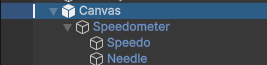

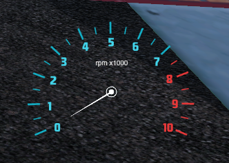

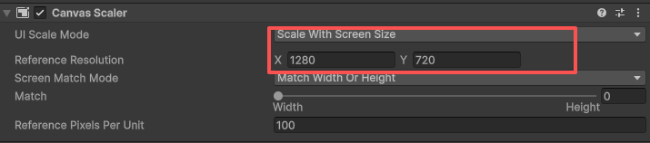

```csharp
using System;
using RacingGame.Car;
using UnityEngine;

namespace RacingGame.GameManager
{
    public class SpeedometerManager : MonoBehaviour
    {
        private GameObject _needle;
        [SerializeField] private CarController _carController;
        private float startPosition = 210f, endPosition = -34f;
        private float vehicleSpeed;
      
        private void Awake()
        {
            _needle = GameObject.Find("Needle");
        }
        private void FixedUpdate()
        {
            vehicleSpeed = _carController.kph;
            SpeedoUpdate();
        }
      
        /// <summary>
        /// 速度计指针更新
        /// </summary>
        private void SpeedoUpdate()
        {
            var perPosition = (startPosition - endPosition) / 100;
            _needle.transform.eulerAngles = new Vector3(0, 0, startPosition - perPosition * vehicleSpeed);
        }
    }
  
}


```
